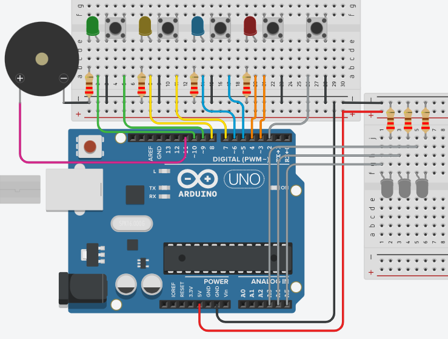
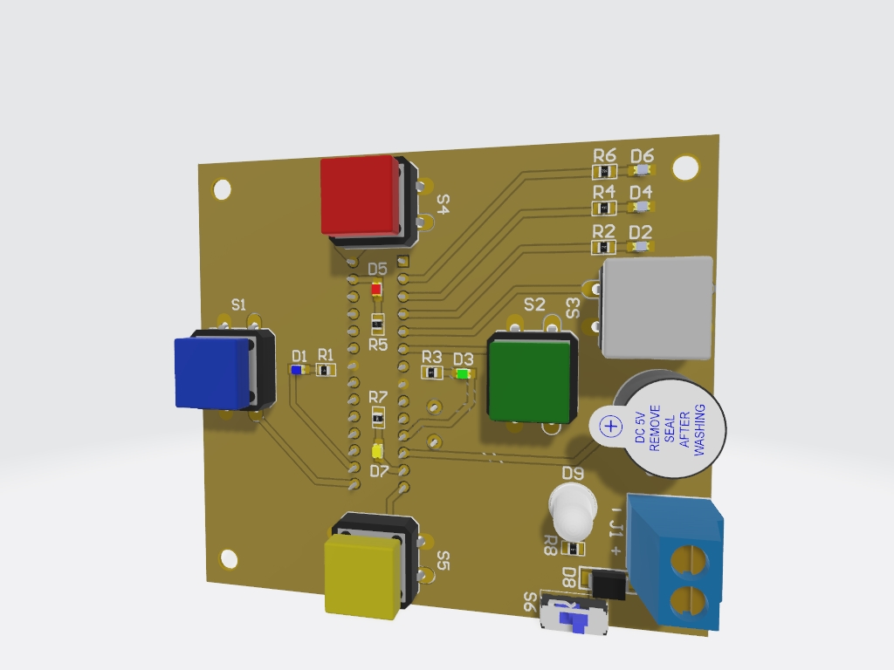
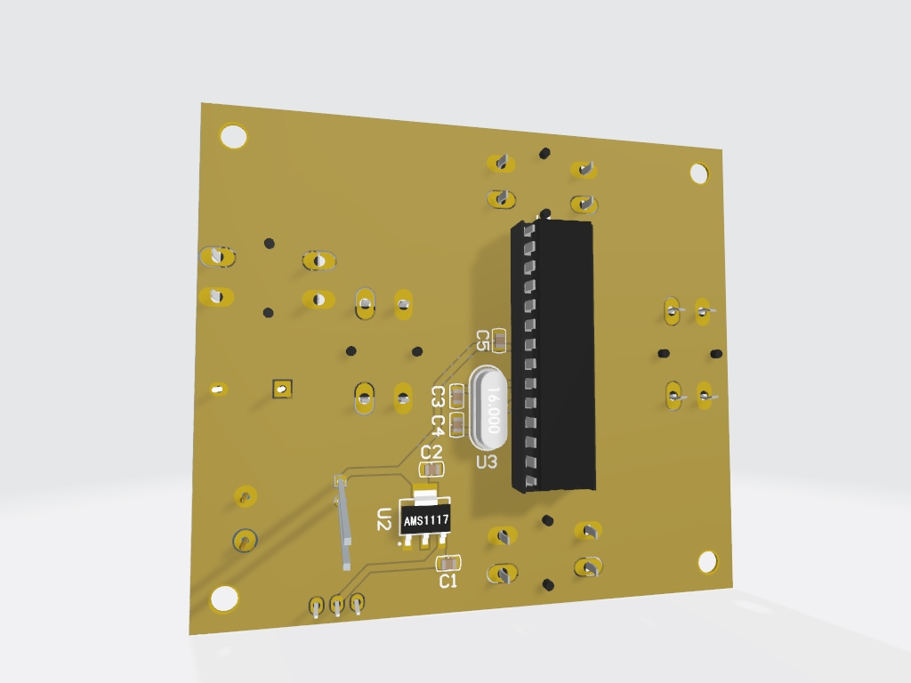

# Genius

## Lista de materias
- 5 botões 12x12 (vermelho, azul, amarelo, verde e branco)
- 4 leds (vermelho, azul, amarelo e verde)
- 3 leds 0805 (brancos)
- 1 leds 5mm (brancos)
- 8 resistores 0805 1k
- 1 ATMEGA328P-PU
- 2 capacitores 0805 22pF
- 1 capacitor 0805 100nF
- 1 cristal 16Mhz
- 1 AMS1117 5V
- 2 capacitores 0805 10uF
- 1 diodo M7
- 1 chave on/off SS12D00G4
- 1 borne kre 2 vias
- 1 buzzer 5V 12mm

## Tinkercad
- Fiz uma simulação antes no Tinkercad para facilitar no teste inicial tanto da eletrônica quando da programação, a foto está anexada abaixo:

## Software
- Utilizei a Arduino IDE para programar.
- O jogos é composto de 3 modos:
.
.
.

## Hardware
- Utilizei o Altium Designer para projetar a PCB.

