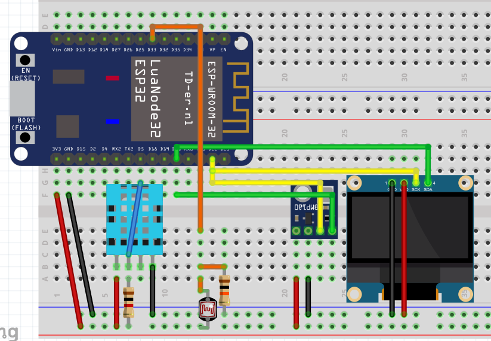

# Weather Station

Nesse projeto, foi feita uma estação meteorológica usando 3 sensores que enviam os valores medidos para um display local, para uma página web e para um aplicativo que pode ser acessado pelo computador ou pelo celular.

São medido 4 valores:
- Umidade;
- Temperatura;
- Luminosidade;
- Pressão atmosférica.

## Dashboard Blynk

Dashboard feito com o aplicativo Blynk IOT que tem a visualização e constante atualização dos valores recebidos remotamente da estação.

## Dashboard HTTP

Página WEB feita com HTML/CSS/JS que tem visualização e constante atualização dos valores recebidos remotamente da estação.

## Display local

Display local para visualizar os valores medidos pelos sensores em tempo real.

## Tests

Esses códigos são apenas testes para verificar o funcionamento dos 3 sensores e dos 2 diplays usados.

## Lista de materiais
- ESP32
- LDR
- RESISTOR 10K
- RESISTOR 1K
- DHT11
- BMP180
- DISPLAY LCD 16X2
OU
- DISPLAY OLED 128x64

